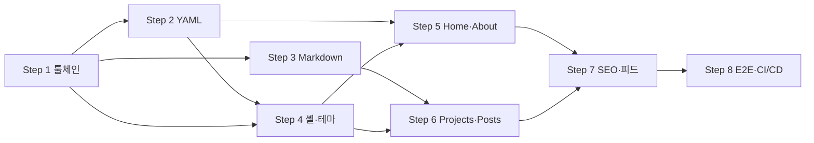

# byron1st.github.io 개인 사이트 구현

Main plan. 이 파일은 **직접 구현되지 않는다** — 각 서브 플랜을 `implement-dev`에 개별 single-step 플랜으로 넘긴다.

Sub-plans:
- [Step 1](./20260729222137_NO-JIRA_PLAN_personal-site-implementation-STEP-1.md) — 툴체인 기반
- [Step 2](./20260729222137_NO-JIRA_PLAN_personal-site-implementation-STEP-2.md) — 콘텐츠 스키마 + YAML 실데이터
- [Step 3](./20260729222137_NO-JIRA_PLAN_personal-site-implementation-STEP-3.md) — Markdown 파이프라인
- [Step 4](./20260729222137_NO-JIRA_PLAN_personal-site-implementation-STEP-4.md) — 전역 셸 + 테마
- [Step 5](./20260729222137_NO-JIRA_PLAN_personal-site-implementation-STEP-5.md) — Home + About
- [Step 6](./20260729222137_NO-JIRA_PLAN_personal-site-implementation-STEP-6.md) — Projects + Posts + PostDetail
- [Step 7](./20260729222137_NO-JIRA_PLAN_personal-site-implementation-STEP-7.md) — SEO 메타 + 피드
- [Step 8](./20260729222137_NO-JIRA_PLAN_personal-site-implementation-STEP-8.md) — E2E + CI/CD + 성능 실측

Research 파일은 없다 — 저장소가 스캐폴드 상태(소스 코드 0줄)라 조사할 기존 코드가 존재하지 않는다.

## Goal

`docs/SPEC.md`가 정의한 텍스트 우선 미니멀 정적 사이트를 구현한다. 프로필·이력·프로젝트는 YAML로, 포스트는 Markdown으로 관리하고, 빌드 시 전 라우트를 `dist/client/**/index.html`로 프리렌더해 GitHub Pages에 올릴 수 있는 상태로 만든다. SPEC의 FR-0 ~ FR-9를 8개 증분 단계로 나누며, **각 단계가 끝난 시점에 프로젝트는 항상 컴파일되고 테스트가 통과**한다.

현재 저장소 상태: `package.json`(의존성·스크립트 확정), `AGENTS.md`, `CLAUDE.md`, `docs/`만 존재. `src/`·`content/`·설정 파일·CI 워크플로 전무. `pnpm install` 미수행.

## Architecture Overview

빌드 타임에 모든 것이 결정되고 런타임에는 정적 파일만 존재한다. 서버·DB·API·인증이 없다.

```
content/*.yaml   ──► @rollup/plugin-yaml ──► src/content/*.ts ──► zod.parse (실패 = 빌드 중단)
content/posts/*.md ──► plugins/markdown.ts ──► { meta, html } 모듈 ──► src/content/posts.ts
                                                          │
                                                          ▼
                                        react-router build (ssr:false + prerender)
                                          ├─ dist/client/**/index.html
                                          └─ buildEnd → scripts/feeds.ts
                                               → rss.xml / sitemap.xml / robots.txt
```

레이어 의존 방향은 항상 아래로: `pages/ → components/ → content/ → lib/`. `content/`는 React를 import 하지 않으므로 Vitest에서 그대로 테스트된다 — **테스트 가능한 로직은 전부 이 계층에 있다.**

## Tech Stack

TypeScript 6.0.3 (strict, `~6.0.3` 고정) · Node 24 · Vite 8 · React 19 · React Router 8 framework mode(`ssr: false` + `prerender`) · Tailwind CSS v4 · zod · gray-matter + unified/remark/rehype · Vitest · Playwright · ESLint 10 flat config(Prettier를 ESLint 규칙으로 실행) · GitHub Actions + Pages. 패키지 매니저는 pnpm.

상세 버전과 "설치하지 않는 것"(`react-router-dom`, `@vitejs/plugin-react`, `@tailwindcss/typography`)은 SPEC의 Dependencies 절과 `AGENTS.md`의 Boundaries를 따른다.

## 기술 전제 검증 (React Router 8 공식 문서, 2026-07-29 확인)

계획 단계에서 확인했고, 모든 단계가 이 전제 위에 서 있다:

- `ssr: false` + `prerender` 조합에서 **prerender 경로에 매칭되는 라우트는 `loader`를 쓸 수 있다.** SPEC FR-6의 "포스트 본문을 라우트 `loader`가 lazy import" 설계가 유효하다. (`prerender` 없는 `ssr:false` = SPA 모드에서만 root 외 `loader`가 금지된다.)
- `ssr: false`에서 **모든 라우트의 `action`·`headers` export는 금지**된다.
- 부모 라우트에 `loader`가 있으면 모든 자식 경로가 프리렌더되어야 한다. 전 경로를 프리렌더하므로 충족되며, `Layout`은 애초에 `loader` 없이 `profile`을 정적 import 한다.
- 시그니처: `prerender({ getStaticPaths })`, `buildEnd({ buildManifest, reactRouterConfig, viteConfig })`.

## Conventions

전 단계에 공통으로 적용되며, 위반은 리뷰에서 차단된다. 원문은 `AGENTS.md`와 SPEC의 Conventions 절이다.

- **Tailwind arbitrary value 금지.** 예외는 grid template(`grid-cols-[8rem_1fr]`, 값은 표준 rem 스케일에서)과 viewport 단위(`min-h-[52vh]`) 두 가지뿐이다.
- **색은 시맨틱 토큰으로만**: `text-fg` `text-muted` `text-faint` `bg-bg` `bg-code-bg` `border-line` `text-accent`. 토큰이 테마별로 값을 바꾸므로 `dark:`는 아이콘 표시 전환 같은 비색상 속성에만 쓴다.
- **반복 시각 패턴은 React 컴포넌트로 추출**한다. `@apply`·`@layer components`를 쓰지 않는다. `.post-body` 스코프 CSS만 예외(마크다운 산출 HTML에 className을 붙일 수 없어서).
- **애니메이션·트랜지션·그림자 금지.** hover 상태 변화만 존재한다.
- **빌드 타임 실패는 즉시 throw**, 메시지에 문제의 파일 경로를 포함한다. `post?.title ?? "제목 없음"` 같은 **런타임 폴백을 만들지 않는다.**
- **단일 출처**: 라우트는 `routes.ts`, 스키마는 `schema.ts`, 색·크기는 `theme.css`, 포스트 목록은 `postMeta.ts` 기반.
- **명명**: 컴포넌트·파일은 `PascalCase`, 훅은 `useXxx`, 그 외 `camelCase`. `content/` 함수는 동사로 시작. boolean prop은 긍정형(`hasBorder`).
- **접근성**: `<div onClick>` 대신 `<Link>`/`<a>`, 아이콘 링크에 `aria-label`, 시맨틱 태그, 포커스 링 유지, 외부 링크는 `target="_blank" rel="noreferrer"`.
- 컴포넌트 파일 100줄 이내를 목표로 한다. 주석은 "왜"만 적는다.
- **모든 수치는 SPEC의 디자인 토큰 표에서 가져온다.** 이 표가 픽셀 판정의 유일한 기준이며, 핸드오프 원본 수치를 직접 쓰지 않는다.

## 계획 단계에서 확정된 결정

| 항목 | 결정 |
| --- | --- |
| About의 Works 섹션 | 스키마에 optional로 유지, 빈 배열이면 섹션 자체를 렌더하지 않음 |
| `content/*.yaml` | `docs/resume.md` 기반 실데이터. 근거 없는 항목(X·LinkedIn 핸들)은 미기재 |
| `projects.yaml` | `personal-harness` 1건만 실데이터 |
| 포스트 | 실제 1개 + `draft: true` 1개 |
| 성능 예산 | Step 8에서 실측·기록. 60KB 초과해도 통과(SPEC 명시: SSG 선택을 되돌리지 않음) |
| 배포 범위 | 워크플로 파일 작성까지. push·Pages 저장소 설정·실배포는 저자 몫 |

## 핵심 구조 결정 — 포스트 목록의 단일 출처

**"순수 모듈 + 두 개의 어댑터"로 쪼갠다.** 이것은 여러 단계에 걸친 직교 결정이라 메인 플랜에 둔다.

`react-router.config.ts`의 `prerender()`/`buildEnd()`는 Vite 번들 밖(Node)에서 실행되므로 `import.meta.glob`을 쓸 수 없다. 반면 `src/content/posts.ts`는 번들 안에서 glob으로 목록을 만든다. 양쪽이 각자 정렬·draft 필터·파일명 파싱을 구현하면 SPEC의 단일 출처 원칙이 깨진다.

- `src/content/postMeta.ts` — **React·Vite·fs 무의존 순수 모듈.** `PostMeta` 타입, frontmatter zod 스키마, `parsePostFilename()`, `sortPosts()`, `groupPostsByYear()`. 단위 테스트 대상은 전부 여기.
- `src/content/posts.ts` — **번들 어댑터.** `import.meta.glob`으로 메타 수집 + 본문 lazy 로드. 정렬·필터는 `postMeta.ts`에 위임.
- `scripts/postFiles.ts` — **Node 어댑터.** `fs` + `gray-matter`로 `content/posts/*.md`를 읽어 같은 `PostMeta[]`를 반환. `prerender()`와 `scripts/feeds.ts`가 공유.

**반려한 대안**: `react-router.config.ts`에서 `src/content/posts.ts`를 직접 import — `import.meta.glob`이 Vite transform 밖에서는 존재하지 않아 실패한다.

## Requirements Coverage

| Requirement | Description | Implemented In |
| --- | --- | --- |
| FR-0 | 전역 셸 (Layout) | Step 4 |
| FR-1 | 테마 (light / dark) | Step 4 |
| FR-2 | 프론트 페이지 `/` | Step 5 |
| FR-3 | About `/about` | Step 2 (데이터) + Step 5 (화면) |
| FR-4 | Projects `/projects` | Step 2 (데이터) + Step 6 (화면) |
| FR-5 | Posts 인덱스 `/posts` | Step 3 (데이터) + Step 6 (화면) |
| FR-6 | Post 상세 `/posts/{slug}` | Step 3 (데이터) + Step 6 (화면·프리렌더) |
| FR-7 | Markdown 파이프라인 | Step 3 |
| FR-8 | SEO 메타 / 피드 / 사이트맵 | Step 7 |
| FR-9 | 빌드 & 배포 | Step 1 (설정) + Step 8 (워크플로) |

## Steps Overview

| Step | Title | Description | Depends On |
| --- | --- | --- | --- |
| 1 | 툴체인 기반 | 설정 파일 일체 + 문서 셸 + 디자인 토큰. `pnpm check`/`pnpm build` 최초 통과 | None |
| 2 | 콘텐츠 스키마 + YAML 실데이터 | zod 스키마 3개, 로더, resume 기반 실데이터, 날짜 포맷터 | Step 1 |
| 3 | Markdown 파이프라인 | Vite plugin, `postMeta.ts`/`posts.ts`/`postFiles.ts`, 포스트 2개 | Step 1 |
| 4 | 전역 셸 + 테마 | Layout/Header/Footer/ThemeToggle/icons, `useTheme`, pre-paint 스크립트 | Step 1, Step 2 |
| 5 | Home + About | `SectionLabel`/`TitleMetaRow`/`MarkerList` + 두 페이지 | Step 2, Step 4 |
| 6 | Projects + Posts + PostDetail | 칩·연도 그리드·`PostBody`, prerender 경로 확장 | Step 3, Step 4 |
| 7 | SEO 메타 + 피드 | `lib/site.ts`·`lib/seo.ts`, 라우트 `meta`, `scripts/feeds.ts`, `buildEnd` | Step 5, Step 6 |
| 8 | E2E + CI/CD + 성능 실측 | `e2e/smoke.spec.ts`, `ci.yml`, `deploy.yml`, gzip 실측 | Step 7 |

## Execution Flow

```
Phase 1: Step 1
Phase 2: Step 2, Step 3   — 병렬 가능 (둘 다 Step 1에만 의존)
Phase 3: Step 4
Phase 4: Step 5, Step 6   — 병렬 가능 (5는 2+4, 6은 3+4)
Phase 5: Step 7
Phase 6: Step 8
```



`병렬 가능`은 **의존 관계상 순서 제약이 없다**는 뜻이다. 단 Step 5와 Step 6은 둘 다 `src/routes.ts`에 자식 라우트를 추가하므로, 동시에 돌리려면 각자 자기 라우트만 추가하도록 하고 그렇지 않으면 순차 실행이 안전하다.

## 단계 간 seam 요약

각 단계가 다음 단계에 노출하는 접합면. 상세는 각 서브 플랜에 있다.

| 노출하는 단계 | seam | 소비하는 단계 |
| --- | --- | --- |
| 1 | 색 토큰 이름, `src/routes.ts` 라우트 정의 지점, `root.tsx`의 스타일 import 지점, `react-router.config.ts`의 `prerender`/`buildEnd` 확장 지점 | 4, 5, 6, 7 |
| 2 | `Profile`·`About`·`Projects` 타입과 검증된 상수, `socials[].kind` 유니온 | 4, 5, 6, 7 |
| 3 | `PostMeta`, `posts`, `groupPostsByYear()`, `loadPostBody(slug)`, `readPostFiles()` | 6, 7 |
| 4 | `routes.ts`의 layout 중첩 구조, `useTheme` 반환 형태, `Layout`의 `content/` import 예외 | 5, 6 |
| 5, 6 | 각 라우트 모듈(= `meta` export를 붙일 자리), 확장된 `prerender()`의 경로 집합 | 7 |
| 7 | 완성된 빌드 산출물(HTML·피드) | 8 |

## Non-goals (전 단계 공통)

i18n·언어 토글·로케일 라우팅, 커스텀 404 페이지, 애니메이션·트랜지션·페이지 전환, 신택스 하이라이팅, 이미지 파이프라인, `@tailwindcss/typography`, 분석 스크립트, 커스텀 도메인(`CNAME`), `/music` 등 확장 페이지, 런타임 폴백 코드, 프레젠테이션 컴포넌트의 단위 테스트, mutation 테스트, 실제 `git push`·Pages 저장소 설정·배포 실행, `docs/design_handoff_personal_site/`의 가짜 데이터를 그대로 옮기는 것.

## Sub-plans

- [Step 1](./20260729222137_NO-JIRA_PLAN_personal-site-implementation-STEP-1.md) - 툴체인 기반
- [Step 2](./20260729222137_NO-JIRA_PLAN_personal-site-implementation-STEP-2.md) - 콘텐츠 스키마 + YAML 실데이터
- [Step 3](./20260729222137_NO-JIRA_PLAN_personal-site-implementation-STEP-3.md) - Markdown 파이프라인
- [Step 4](./20260729222137_NO-JIRA_PLAN_personal-site-implementation-STEP-4.md) - 전역 셸 + 테마
- [Step 5](./20260729222137_NO-JIRA_PLAN_personal-site-implementation-STEP-5.md) - Home + About
- [Step 6](./20260729222137_NO-JIRA_PLAN_personal-site-implementation-STEP-6.md) - Projects + Posts + PostDetail
- [Step 7](./20260729222137_NO-JIRA_PLAN_personal-site-implementation-STEP-7.md) - SEO 메타 + 피드
- [Step 8](./20260729222137_NO-JIRA_PLAN_personal-site-implementation-STEP-8.md) - E2E + CI/CD + 성능 실측
